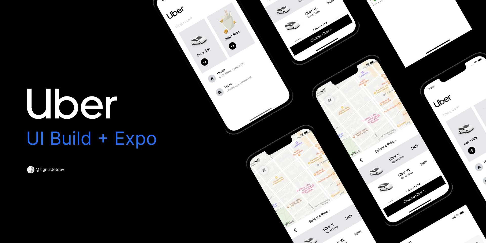
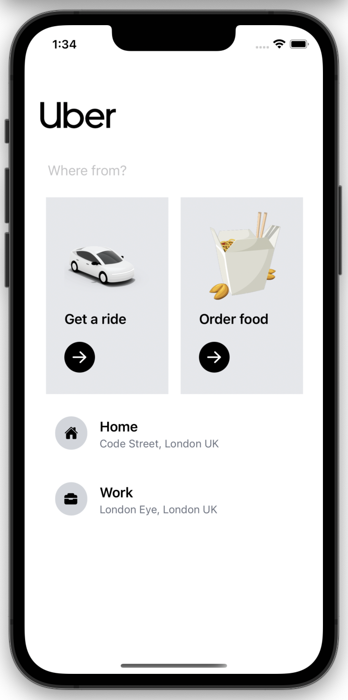
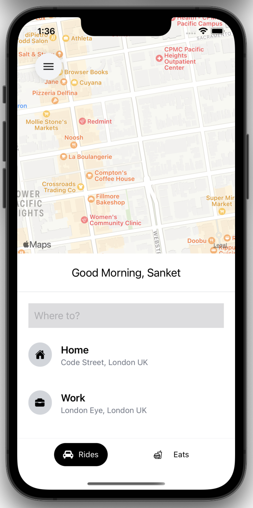
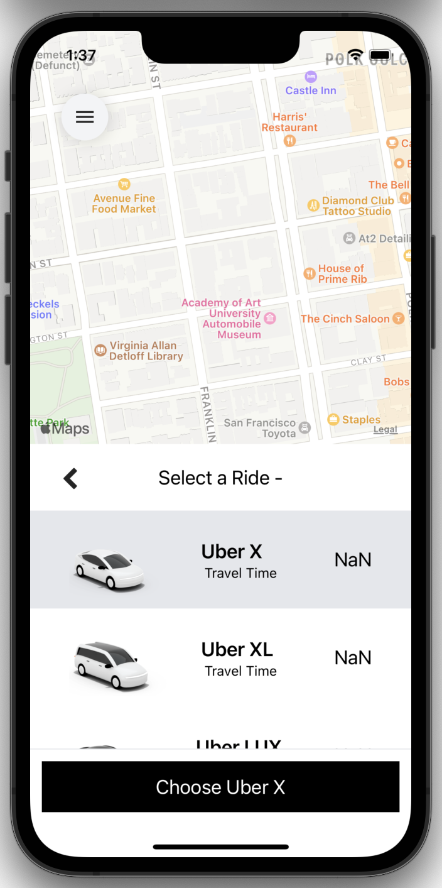

    
    <h6>Move with Safety</h5>
        Logo made using <a href='https://www.figma.com/'>Figma</a>

 

## 🧑🏻‍💻 Story

### Uber Clone is an app that allows users to search a place and create a ride request and get the estimated fare and provide best way to get to the destination. Uber Clone uses the Google Maps API for Showing Maps on MapScreen and Google Places Autocomplete for location based search. This UI build using tailwindcss and react native components.

## 📱 Snapshot

    
    
    

 

## 🍜 Ingredients

- [Expo](https://expo.dev/)
- [React Native](https://reactnative.dev/)
- [React Navigation](https://reactnavigation.org/)
- [React Native Google Places Autocomplete](https://github.com/FaridSafi/react-native-google-places-autocomplete#readme)
- [Google Cloud Platform](https://console.developers.google.com)
- [Tailwind CSS](https://tailwindcss.com/)
- [Redux](https://redux.js.org/)

## 📝 License 

This project is under the terms of the MIT license. For more information, please refer to the license [documentation](LICENSE.md).

## ☣️ Disclaimer

The contents of these pages are provided as an information guide only. While every effort is made in preparing the material for publication, no responsibility is accepted by or on behalf of the owner(s) for any errors, omissions or misleading statements on these pages or any site to which these pages connect. Although every effort is made to ensure the reliability of listed sites this cannot be taken as an endorsement of these sites.
